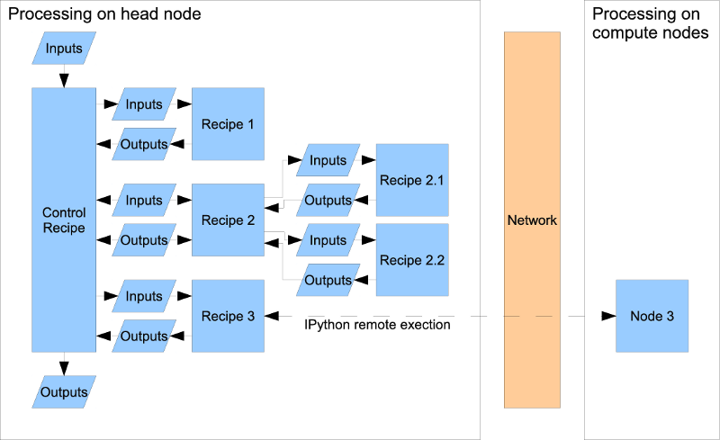

.. _framework-overview:

**********************
Overview of a Pipeline
**********************

Before plunging into the nitty-gritty of all the various components that make
up a pipeline, let's first take a bird's-eye overview of the concepts
involved.

The figure shows a schmatic pipeline layout, illustrating most of the relevant
concepts. We will consider each of these in turn below.

Recipes
=======

A *recipe* is a unit of the pipeline. It consists of a a task with a given set
of inputs and outputs. A given recipe may contain calls to subsidiary recipes,
for which it will provide the inputs and use the outputs in its own
processing. Note that the whole pipeline control structure is itself a recipe:
it takes a given set of inputs (visibility data) and produces some outputs
(images and associated metadata) by running through a series of defined steps.
In fact, each of those steps is itself a recipe -- one for flagging, one for
calibration, and so on.

Although some recipes are provided with the pipeline framework, it is
anticipated that users will wish to define their own. A search path for
recipes can be specified, enabling each user to maintain their own private (or
shared) repositories of recipes.

Tasks and Configuration
=======================

A recipe describes the steps that need to be taken to perform some particular
action on the data. For instance, a recipe might describe how to set up and
run an imager process. Often, the recipe will take a series of parameters
describing how it should be run -- what time steps to image, whether to use
the W-projection algorithm, the shape or the restoring beam, and so on. These
are provided as a series of input arguments to the recipe. Some sets of
arguments will be used repeatedly: a set of default configurations for
different modes, say. These can be bundled together as a *task*: a recipe
together with a set of defined parameters, and saved in a configuration file
for easy access.

As with recipes, it is anticipated that users will build up their own
libraries of pre-defined tasks for whatever applications they find necessary.

Control
=======

The *control* recipe is a specialist type of a normal recipe. The fundamentals
are the same; however, it contains some additional "housekeeping" logic which
may be useful for starting a pipeline. For instance, the control recipe can
configure a logging system for the pipeline, and may be used to interface with
LOFAR's MAC/SAS control system.

.. _cluster-layout:

Cluster Layout
==============

The pipeline framework makes the assumption that it will run on a cluster
comprised of a "head node" and a number of "compute nodes". The pipeline
control logic runs on the head node, and may perform less compute-intensive
jobs here. When required, jobs are dispatched over the network to the compute
nodes: the head node may then wait and receive the results before continuing.
Job definition and parameters may be pushed to the compute nodes directly from
the head using :ref:`ipython-blurb`; however, for bandwidth and latency
reasons, large data files should be written to and read from shared NFS
mounts.

